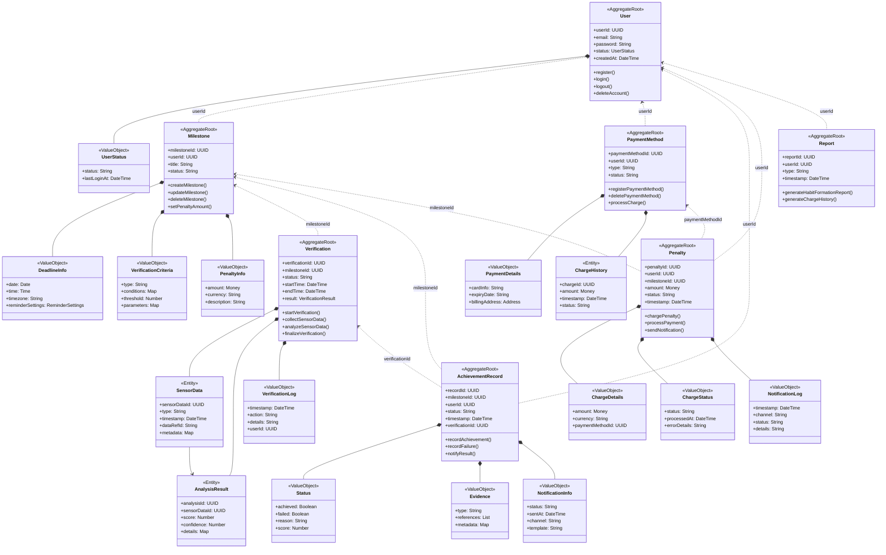

```mermaid
classDiagram
    %% ユーザー集約
    class User {
        <<AggregateRoot>>
        +userId: UUID
        +email: String
        +password: String
        +status: UserStatus
        +createdAt: DateTime
        +register()
        +login()
        +logout()
        +deleteAccount()
    }
    
    class UserStatus {
        <<ValueObject>>
        +status: String
        +lastLoginAt: DateTime
    }
    
    User *-- UserStatus
    
    %% 支払い方法集約
    class PaymentMethod {
        <<AggregateRoot>>
        +paymentMethodId: UUID
        +userId: UUID
        +type: String
        +status: String
        +registerPaymentMethod()
        +deletePaymentMethod()
        +processCharge()
    }
    
    class PaymentDetails {
        <<ValueObject>>
        +cardInfo: String
        +expiryDate: String
        +billingAddress: Address
    }
    
    class ChargeHistory {
        <<Entity>>
        +chargeId: UUID
        +amount: Money
        +timestamp: DateTime
        +status: String
    }
    
    PaymentMethod *-- PaymentDetails
    PaymentMethod *-- ChargeHistory
    
    %% マイルストーン集約
    class Milestone {
        <<AggregateRoot>>
        +milestoneId: UUID
        +userId: UUID
        +title: String
        +status: String
        +createMilestone()
        +updateMilestone()
        +deleteMilestone()
        +setPenaltyAmount()
    }
    
    class DeadlineInfo {
        <<ValueObject>>
        +date: Date
        +time: Time
        +timezone: String
        +reminderSettings: ReminderSettings
    }
    
    class VerificationCriteria {
        <<ValueObject>>
        +type: String
        +conditions: Map
        +threshold: Number
        +parameters: Map
    }
    
    class PenaltyInfo {
        <<ValueObject>>
        +amount: Money
        +currency: String
        +description: String
    }
    
    Milestone *-- DeadlineInfo
    Milestone *-- VerificationCriteria
    Milestone *-- PenaltyInfo
    
    %% 検証集約
    class Verification {
        <<AggregateRoot>>
        +verificationId: UUID
        +milestoneId: UUID
        +status: String
        +startTime: DateTime
        +endTime: DateTime
        +result: VerificationResult
        +startVerification()
        +collectSensorData()
        +analyzeSensorData()
        +finalizeVerification()
    }
    
    class SensorData {
        <<Entity>>
        +sensorDataId: UUID
        +type: String
        +timestamp: DateTime
        +dataRefId: String
        +metadata: Map
    }
    
    class AnalysisResult {
        <<Entity>>
        +analysisId: UUID
        +sensorDataId: UUID
        +score: Number
        +confidence: Number
        +details: Map
    }
    
    class VerificationLog {
        <<ValueObject>>
        +timestamp: DateTime
        +action: String
        +details: String
        +userId: UUID
    }
    
    Verification *-- SensorData
    Verification *-- AnalysisResult
    Verification *-- VerificationLog
    SensorData --> AnalysisResult
    
    %% 達成記録集約
    class AchievementRecord {
        <<AggregateRoot>>
        +recordId: UUID
        +milestoneId: UUID
        +userId: UUID
        +status: String
        +timestamp: DateTime
        +verificationId: UUID
        +recordAchievement()
        +recordFailure()
        +notifyResult()
    }
    
    class Status {
        <<ValueObject>>
        +achieved: Boolean
        +failed: Boolean
        +reason: String
        +score: Number
    }
    
    class Evidence {
        <<ValueObject>>
        +type: String
        +references: List
        +metadata: Map
    }
    
    class NotificationInfo {
        <<ValueObject>>
        +status: String
        +sentAt: DateTime
        +channel: String
        +template: String
    }
    
    AchievementRecord *-- Status
    AchievementRecord *-- Evidence
    AchievementRecord *-- NotificationInfo
    
    %% ペナルティ集約
    class Penalty {
        <<AggregateRoot>>
        +penaltyId: UUID
        +userId: UUID
        +milestoneId: UUID
        +amount: Money
        +status: String
        +timestamp: DateTime
        +chargePenalty()
        +processPayment()
        +sendNotification()
    }
    
    class ChargeDetails {
        <<ValueObject>>
        +amount: Money
        +currency: String
        +paymentMethodId: UUID
    }
    
    class ChargeStatus {
        <<ValueObject>>
        +status: String
        +processedAt: DateTime
        +errorDetails: String
    }
    
    class NotificationLog {
        <<ValueObject>>
        +timestamp: DateTime
        +channel: String
        +status: String
        +details: String
    }
    
    Penalty *-- ChargeDetails
    Penalty *-- ChargeStatus
    Penalty *-- NotificationLog
    
    %% レポート集約
    class Report {
        <<AggregateRoot>>
        +reportId: UUID
        +userId: UUID
        +type: String
        +timestamp: DateTime
        +generateHabitFormationReport()
        +generateChargeHistory()
    }
    
    %% 集約間の関係（IDによる参照）
    User <.. Milestone : userId
    User <.. PaymentMethod : userId
    User <.. AchievementRecord : userId
    User <.. Penalty : userId
    User <.. Report : userId
    
    Milestone <.. Verification : milestoneId
    Milestone <.. AchievementRecord : milestoneId
    Milestone <.. Penalty : milestoneId
    
    Verification <.. AchievementRecord : verificationId
    
    PaymentMethod <.. Penalty : paymentMethodId
```
