# Sequence Diagrams (Current Implementation)

These diagrams cover the API flows that are currently implemented. All API paths are
under `/api/v1` unless noted otherwise.

## Health Check

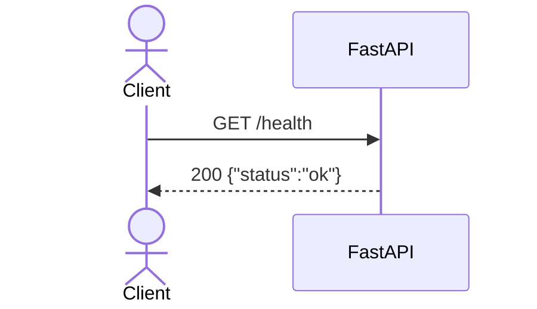

## Auth - Google Login

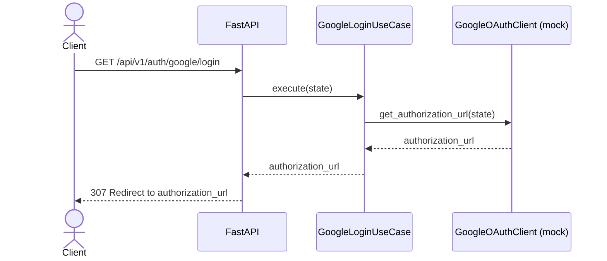

## Auth - Google Callback

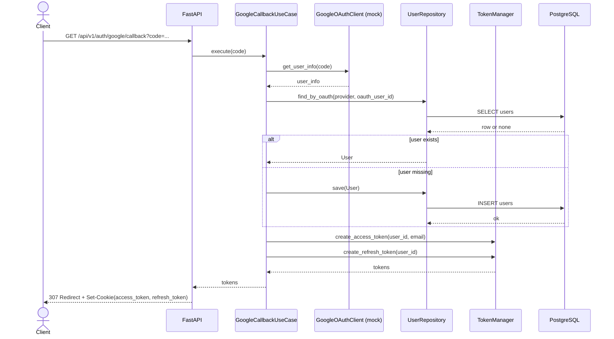

## Auth - Get Current User

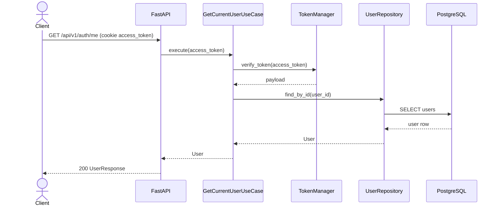

## Auth - Logout

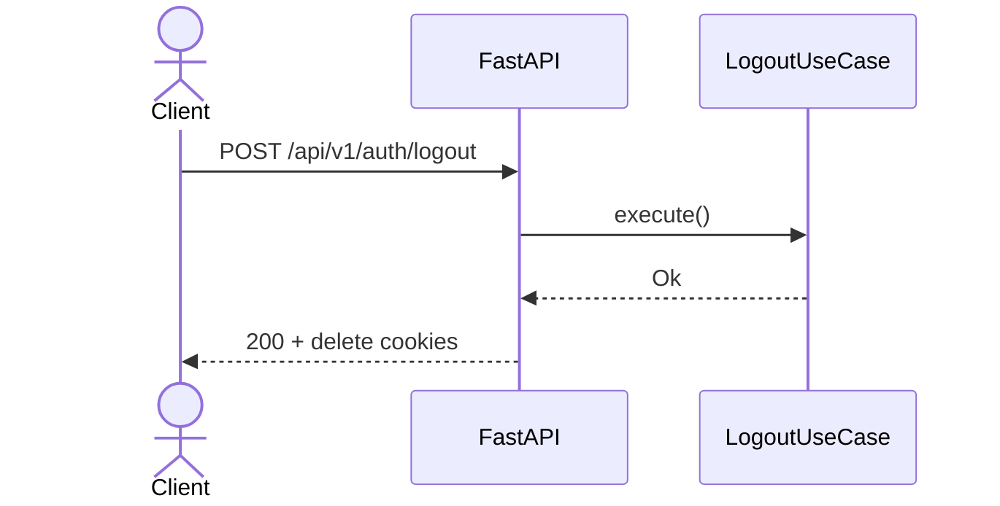

## Milestone - Create

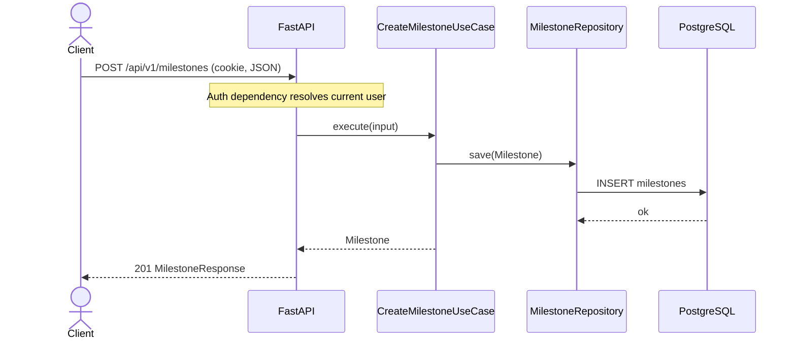

## Milestone - List

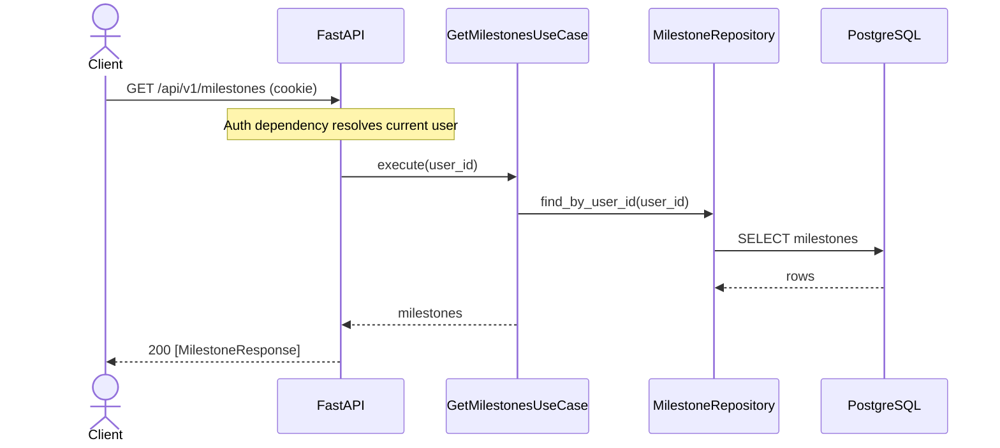

## Milestone - Update

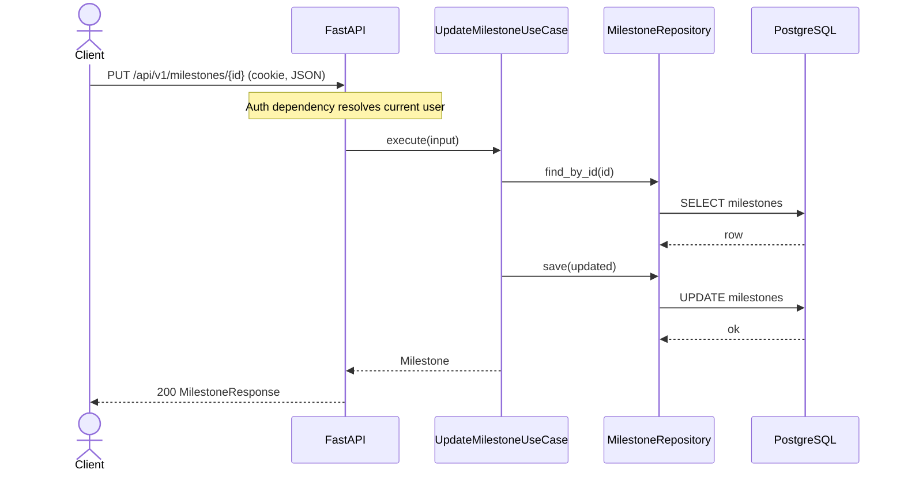

## Milestone - Delete

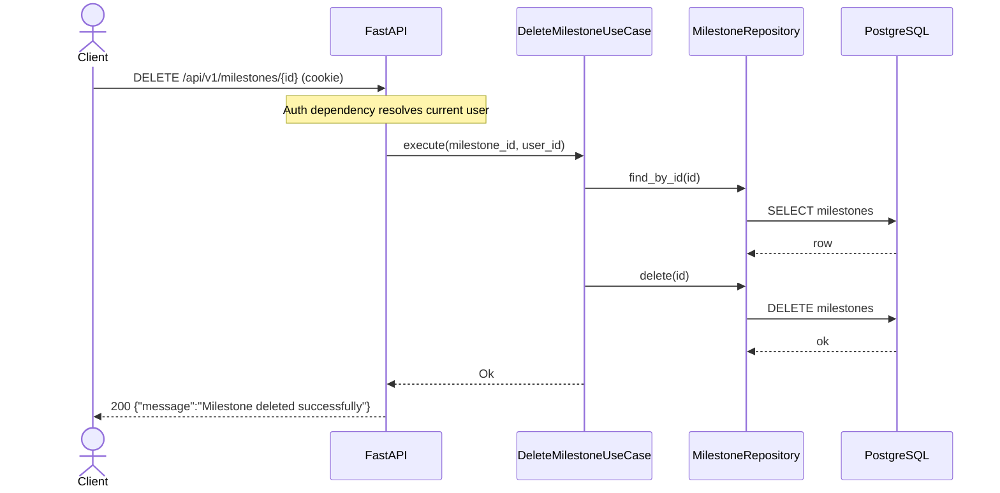

## Verification - Start

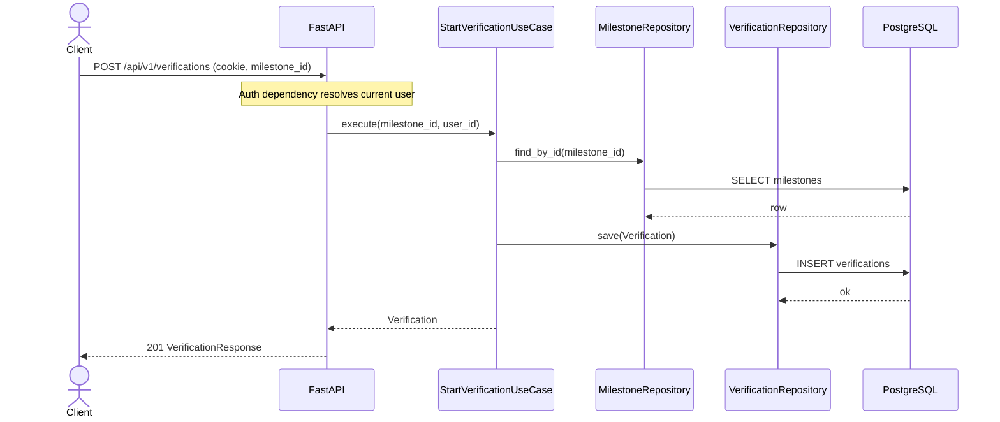

## Verification - Submit Location

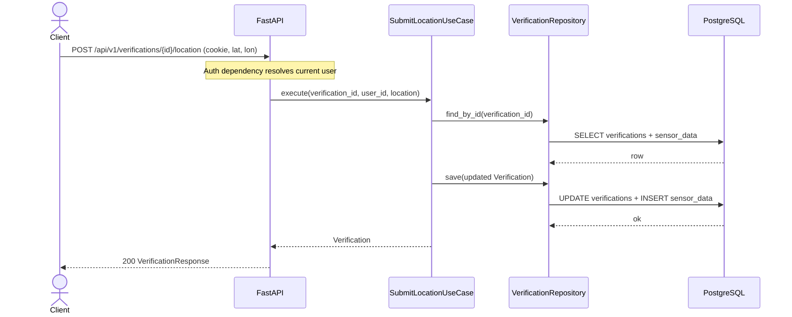

## Verification - Complete

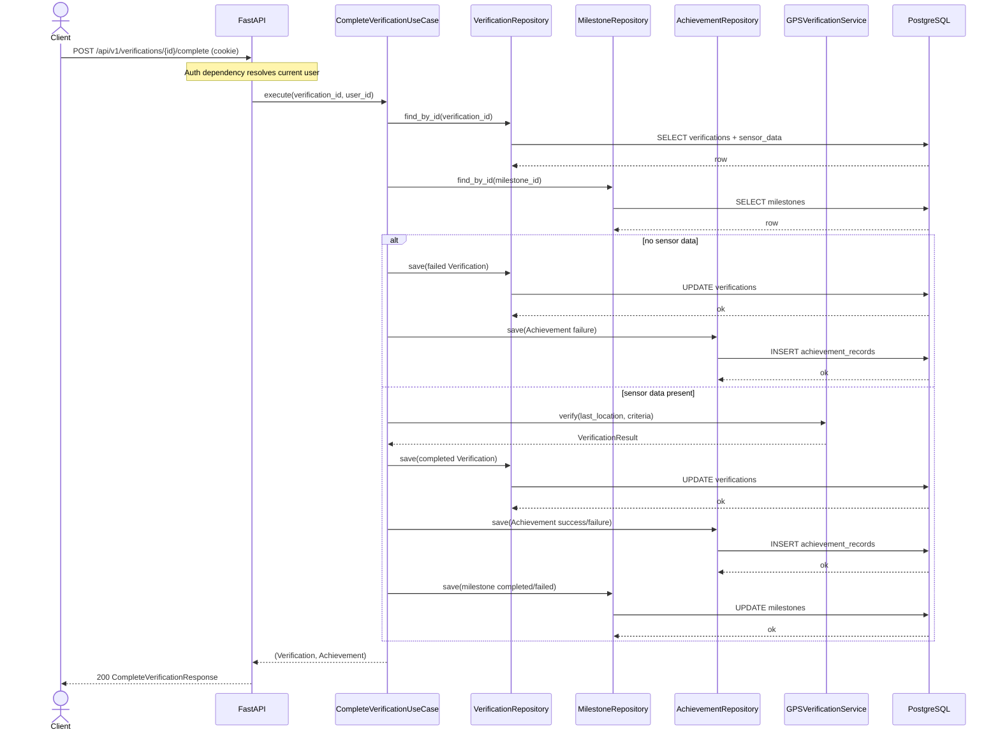
